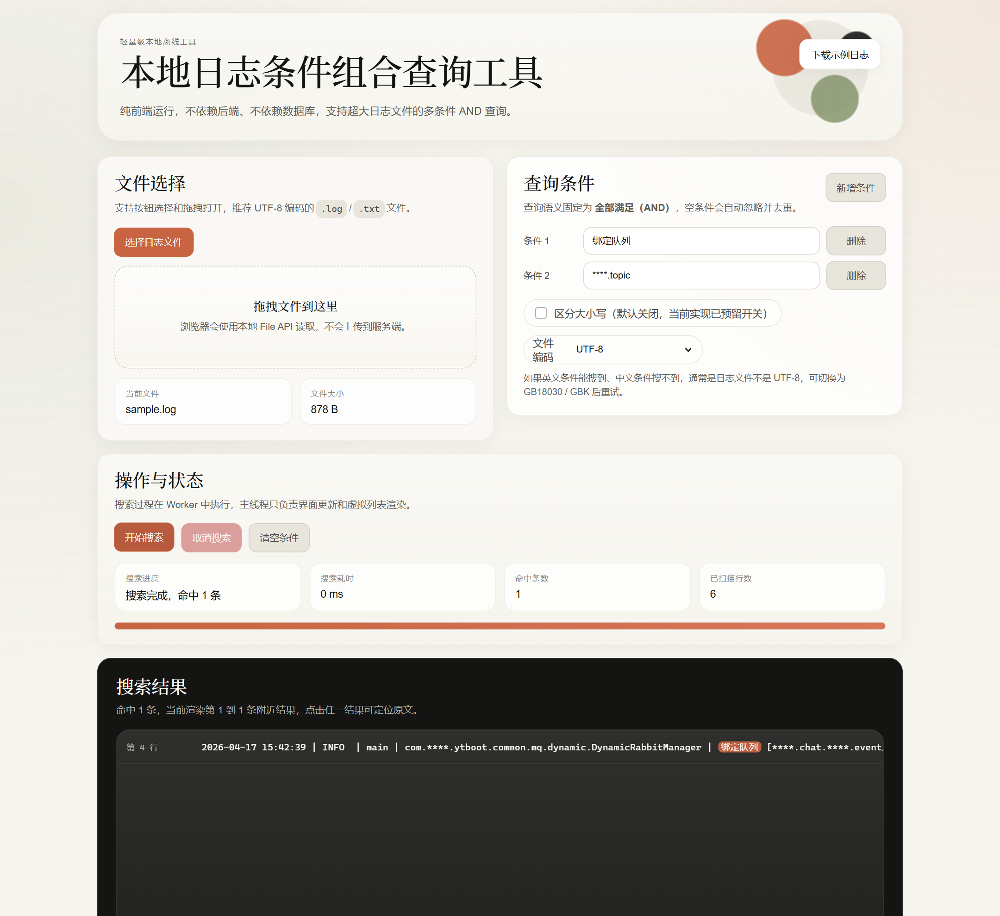
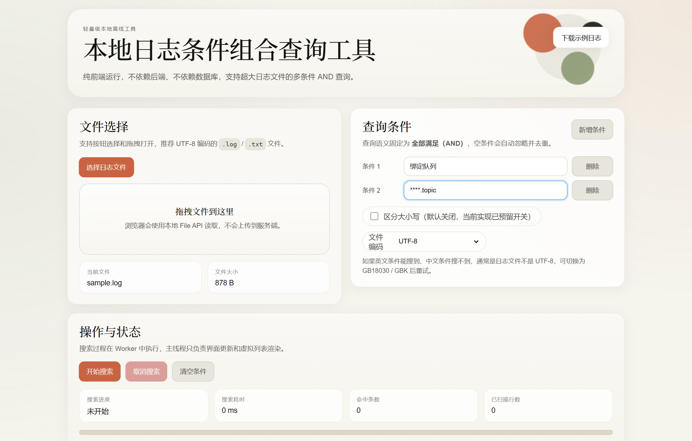
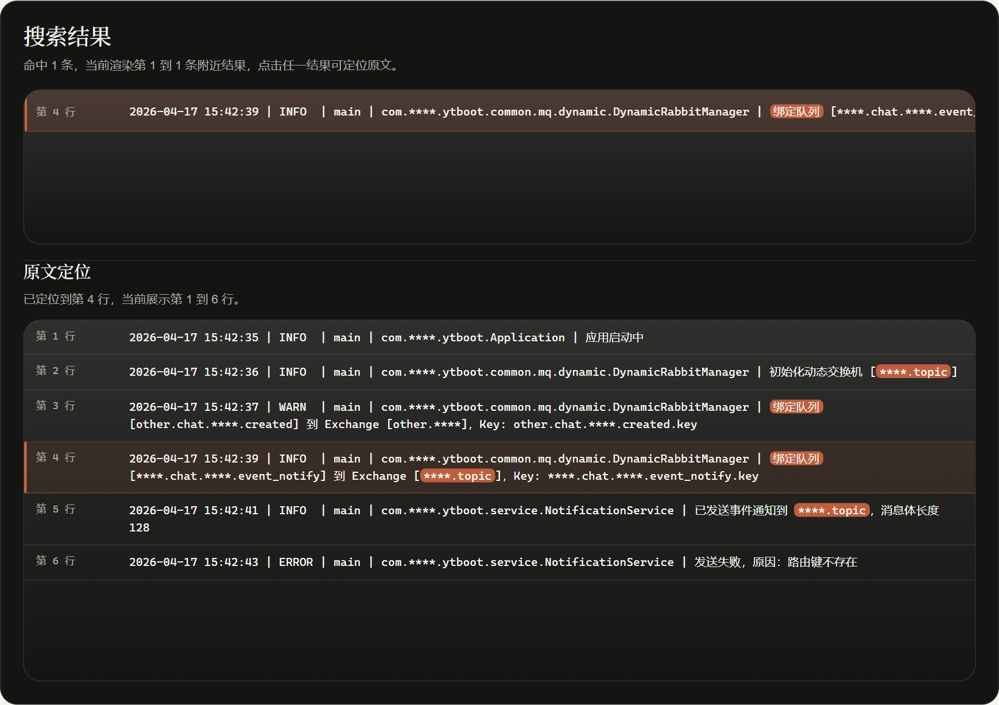

# 本地日志条件组合查询工具

<p align="center">在浏览器里，完成本地大日志的多条件 AND 搜索、命中高亮与原文定位。</p>

<p align="center">
  
  
  
  
</p>



> 上图为当前版本真实界面截图，基于仓库内置示例日志拍摄，截图与示例日志内容均已做脱敏处理。

## 这个工具适合什么时候打开

- 手里只有一份本地日志，不想搭后端、不想上数据库
- 需要确认“同一行是否同时包含多个关键字”
- 需要在大文件里快速搜索，并继续查看命中行上下文
- 现场排查 MQ、定时任务、接口调用、批处理等文本日志

## 为什么它更顺手

- 纯本地运行，日志不会上传到服务端
- 多条件固定为 AND，适合做组合条件确认
- 支持中文、英文、带符号字符串混合查询
- 支持 `UTF-8`、`GB18030 / GBK` 编码切换
- 搜索过程边扫边出结果，可随时取消
- 点击命中结果后，可直接查看附近原文上下文
- 使用 `Web Worker + 分块读取 + 虚拟滚动`，对大文件更友好

## 真实界面截图

### 1. 文件选择与条件录入



### 2. 命中后直接查看上下文



## 一分钟上手

### 方式一：直接打开

直接双击 `index.html` 即可使用。

### 方式二：本地静态服务

如果浏览器对本地文件权限更严格，可以在项目目录执行：

```powershell
python -m http.server 8080
```

然后打开：

```text
http://127.0.0.1:8080
```

### 基本使用步骤

1. 选择本地 `.log` / `.txt` 文件，或者直接拖拽导入
2. 输入一个或多个查询条件
3. 按需切换文件编码
4. 点击“开始搜索”
5. 点击任意命中结果，查看对应日志上下文

## 典型查询示例

例如你想确认下面两个条件是否同时出现：

- `绑定队列`
- `****.topic`

只要原始日志行同时包含这两个条件，就会被命中并高亮显示。

## 核心能力

| 能力 | 说明 |
| --- | --- |
| 本地文件导入 | 支持按钮选择与拖拽导入本地日志文件 |
| 多条件查询 | 自动忽略空条件，并在搜索前 `trim` 与去重 |
| 查询语义 | 固定为 AND，适合做组合条件确认 |
| 编码切换 | 支持 `UTF-8`、`GB18030 / GBK` |
| 搜索体验 | 边搜索边返回结果，支持取消搜索 |
| 命中展示 | 显示行号、命中数、耗时、进度、高亮结果 |
| 原文定位 | 点击结果即可查看命中行上下文 |
| 大文件优化 | 分块读取、Worker 扫描、结果区虚拟滚动 |

## 为什么适合大文件

- 不整文件读入内存，而是按 `chunk` 顺序扫描
- 重活放在 `Web Worker` 中，主线程主要负责界面渲染
- 结果区只渲染可视区域附近内容，避免大量 DOM 带来的卡顿
- 默认只保存命中的结果行，对“大文件但命中较少”的场景更友好

## 示例日志

示例文件见：

```text
samples/sample.log
```

其中包含这条示例日志：

```text
2026-04-17 15:42:39 | INFO  | main | com.****.ytboot.common.mq.dynamic.DynamicRabbitManager | 绑定队列 [****.chat.****.event_notify] 到 Exchange [****.topic]，Key: ****.chat.****.event_notify.key
```

## 常见问题

### 1. 英文能搜到，中文搜不到

优先检查“文件编码”是否正确：

- `UTF-8`：适合大多数现代日志文件
- `GB18030 / GBK`：适合部分 Windows 环境导出的中文日志

### 2. 文件读取时报权限错误

如果出现下面这类报错：

```text
The requested file could not be read, typically due to permission problems that have occurred after a reference to a file was acquired.
```

建议按下面顺序处理：

1. 先把日志文件复制到本地普通目录
2. 优先使用本地静态服务方式打开页面
3. 重新选择一次文件后再搜索

### 3. 命中结果很多时会不会占内存

会有一定占用。当前实现不会缓存整份日志全文，但会保留命中的结果行，所以内存占用会随着命中数增加而上升。

## 项目结构

```text
log-search/
├─ index.html
├─ styles.css
├─ app.js
├─ README.md
├─ docs/
│  └─ screenshots/
└─ samples/
   └─ sample.log
```

<details>
<summary>展开查看实现亮点</summary>

- 主线程负责文件选择、条件管理、状态展示、结果渲染和原文预览
- `Worker` 负责分块解码、逐行匹配、进度回传和结果增量返回
- 最终匹配严格基于原始整行文本执行 AND 判断
- 高亮基于原始字符串计算，不依赖分词结果，避免符号场景失真
- 结果区使用固定行高的虚拟滚动，减少大批量命中时的渲染压力

</details>

<details>
<summary>展开查看手工验证建议</summary>

1. 打开 `index.html`
2. 选择 `samples/sample.log`
3. 输入 `绑定队列` 和 `****.topic`
4. 点击“开始搜索”
5. 确认至少命中 1 条，并可点击结果查看上下文
6. 切换为单条件后再次搜索，确认结果数增加
7. 准备更大的日志文件，确认搜索过程中页面仍可交互且支持取消

</details>

## 已知限制

- 当前未做 `GBK / GB18030` 自动识别，需要手动切换编码
- 当前为纯字符串包含匹配，未引入正则、时间范围、字段级结构化过滤
- 结果列表为了稳定虚拟滚动，采用固定行高单行展示

## 后续可扩展方向

- 增加结果导出
- 增加命中数量上限和超低内存模式
- 增加条件分组，例如 `AND / OR` 组合
- 增加日志时间范围过滤
- 增加命中统计面板
